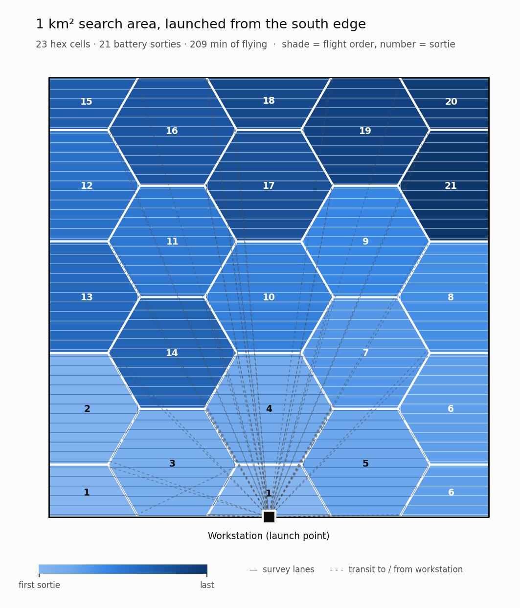
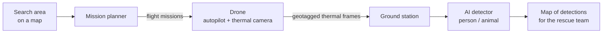
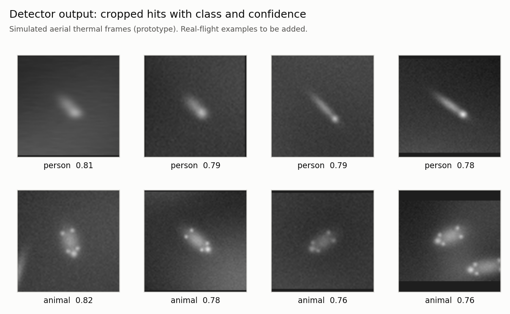

# SAR Thermal Drone

**An autonomous search-and-rescue drone that finds people and animals using a thermal camera.**

> Hackathon project by **[TEAM NAME]**: [member 1], [member 2], [member 3], [member 4]

## The problem

When someone goes missing in open country, searching even 1 km² on foot takes a ground team hours, and at night it is slower still.
A thermal camera can spot body heat in the dark and through light cover, but someone still has to fly the drone and watch thousands of frames for a single warm shape.

## Our solution

We split the job into four stages, so no one has to fly by hand or watch the video feed.

1. **Plan.** The search area is divided into hexagonal cells. Each cell is sized so that one battery can cover it, and the drone gets an automatic flight path for every cell.
2. **Fly.** The drone flies each mission on its own and photographs the ground with a thermal camera. Every frame is saved with its GPS position.
3. **Detect.** After landing, an AI model scans every frame for people and animals.
4. **Report.** Every detection is placed on a map, with the thermal image of what was seen, so the rescue team knows where to go.

## How it works

### 1. Mission planning

- The search area is **tiled with hexagons**. Hexagons fit together with no gaps, and every neighbour is the same distance away, so "nearest cell next" is always well-defined.
- **Cell size comes from the battery.** The planner works out how much ground one battery can cover, including takeoff, the trip out and back, the turns and landing. It then makes each cell exactly that big, so one cell is one flight.
- Inside each cell, the drone flies a **lawnmower pattern**: parallel passes spaced so the camera's view overlaps with no gaps.
- Cells are flown **nearest first**. Optionally, they can be ranked by how likely a person is to be there, based on the terrain in satellite imagery.
- The output is a standard mission file that loads straight into the ArduPilot autopilot.

**Choosing where to launch from.** You cannot always launch from the middle of the area. The planner compares launch points before you go out: from the middle of one edge the search takes about 16% longer than from the centre, and from a corner about 40% longer.

### 2. Flight and capture

- An **ArduPilot** flight controller flies each mission automatically.
- A small onboard computer takes a thermal photo at fixed distance intervals, close enough that consecutive photos overlap. It records the GPS position **and the drone's tilt** at the same moment, and saves both to a microSD card.
- Frames are written so that a sudden power cut, such as a battery being unplugged after landing, does not lose the data already recorded.

### 3. Correcting for wind

To hold its position in wind, a drone leans into it, and a fixed camera leans with it. The camera then photographs ground a few metres downwind of the point directly below the drone.
At 8 m/s of wind that is a **3.7 m error** in every coordinate. Because we log the tilt with each frame, we can correct each position back to the true spot on the ground.

### 4. Detection

- A **YOLO-based model** trained on aerial thermal imagery finds two classes: **person** and **animal**.
- Detection runs on a laptop after the flight, not on the drone. That keeps the drone light, and every frame gets checked by the full model.
- The detection threshold is set deliberately low, because for search and rescue a missed person is far worse than a false alarm that a human dismisses in a second.

### 5. Report

Every detection becomes a marker on an interactive map, coloured by class. Each marker shows the thermal close-up of what was seen and its coordinates.
The coordinator checks a few dozen close-ups instead of scrolling through thousands of raw frames.

## Results so far

| What we measured | Result |
|---|---|
| Detector accuracy on **simulated** thermal data (mAP50) | 0.96 (person 0.95, animal 0.98) |
| Detector accuracy on **real** thermal data | *in progress* |
| Predicted vs actual flight time per mission | within 0.1 min, tested in the ArduPilot simulator |
| How closely the drone follows its planned passes | under 0.2 m on average |
| Wind-tilt position error corrected | 3.7 m at 8 m/s wind |
| Coverage of each cell | over 99% |

The simulated-data result shows the full system works end to end. Real-data accuracy will be reported once the model has been trained and tested on real thermal footage.
All flight results so far come from the ArduPilot simulator; real flight tests are next.

## Tech stack

| Area | Tools |
|---|---|
| Flight control | ArduPilot, MAVLink |
| Detection | Python, PyTorch, YOLO (Ultralytics), OpenCV |
| Planning and maps | Python, Folium / Leaflet |
| Testing | ArduPilot SITL (software-in-the-loop simulator) |
| Training | Google Colab (GPU) |

## Hardware

| Part | Choice |
|---|---|
| Frame | F450 quadcopter, about 1.8 kg all-up weight |
| Flight controller | ArduPilot-compatible |
| Thermal camera | FLIR Lepton 3.5 |
| Onboard computer | Raspberry Pi Zero 2 W |
| Survey height | 25–30 m above ground |

We fly at 25–30 m because higher than about 30 m a person lying down covers too few pixels in the thermal image to be detected reliably.

## Datasets

The model is trained on public aerial thermal datasets: **HIT-UAV** (people) and **BIRDSAI** (people and animals, via LILA BC).
We are adding our own labelled flight footage.

## What's next

- [ ] Train and evaluate on real thermal data
- [ ] First real flight tests and check the timing against the simulator
- [ ] Collect and label our own footage (local animals, people lying down)
- [ ] Live alerts from the drone during flight

## Source code

The source code is not public. For evaluation access, contact the team at **[contact email]**.

## Safety and regulations

The drone is in the DGCA **micro** category (250 g to 2 kg), which requires a UIN registration on Digital Sky. Flights are made only in zones where flying is permitted.
A human pilot starts every mission and can take over at any time.

## Acknowledgements

[ArduPilot](https://ardupilot.org) · [Ultralytics YOLO](https://github.com/ultralytics/ultralytics) · HIT-UAV (Suo et al.) · BIRDSAI (Bondi et al.) and [LILA BC](https://lila.science) · [Folium](https://python-visualization.github.io/folium/)

---

© 2026 [TEAM NAME]. All rights reserved.
